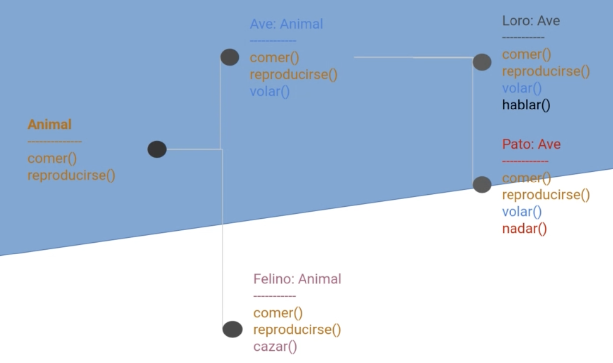
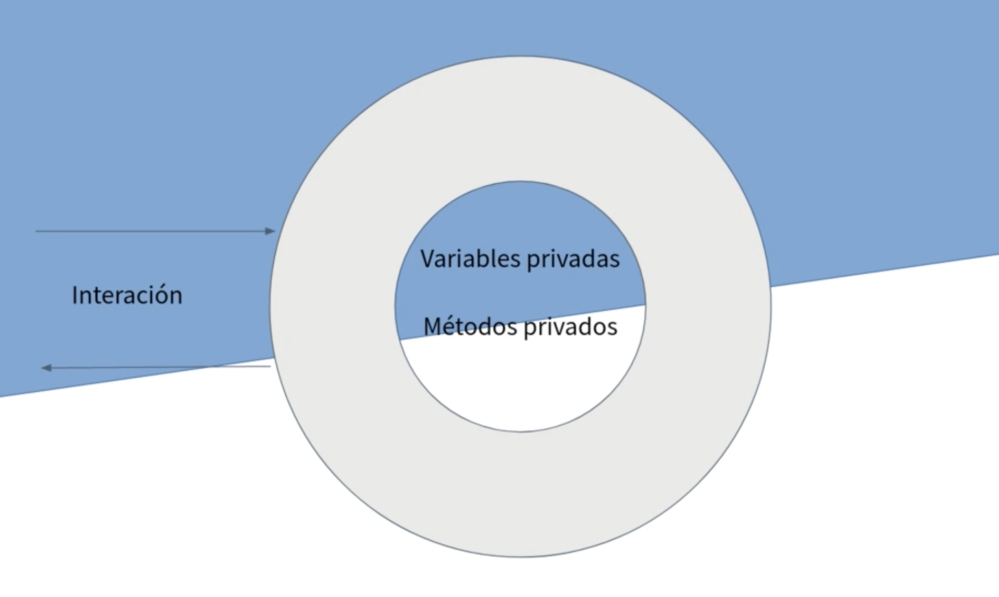
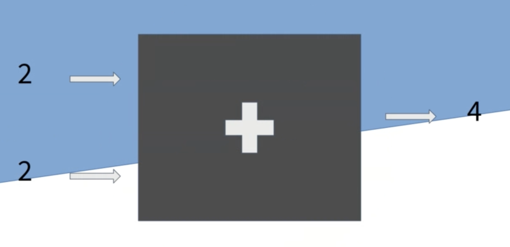
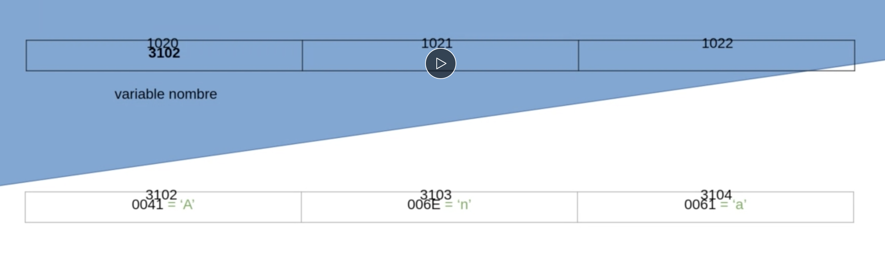
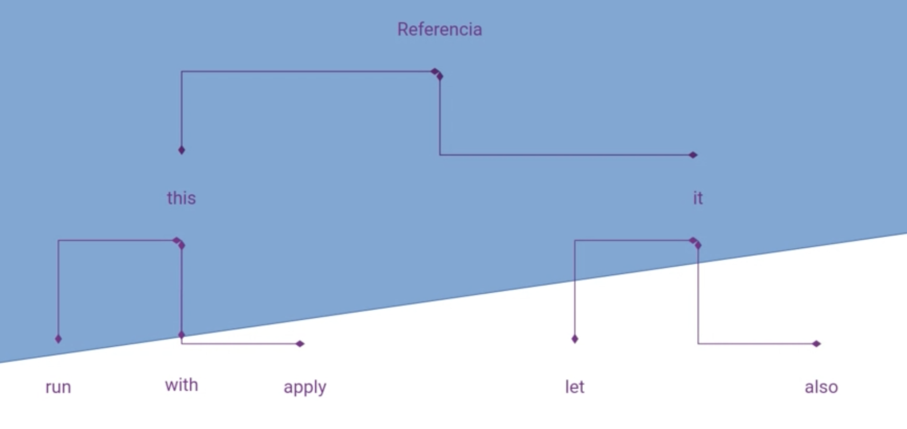
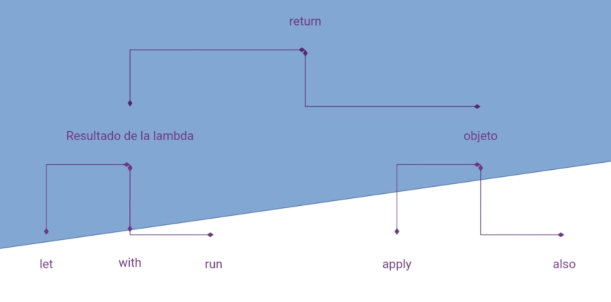

# M1. Introducción a Kotlin

* [0. Introducción POO](#0-introducción-poo)
* [1. Herencia en Kotlin](#1-herencia-en-kotlin)
* [2. Operadores](#2-operadores)
* [3. Convenciones de código](#3-convención-de-nombres)
* [4. Herencia](#4-el-concepto-de-herencia)
* [5. Encapsulación](#5-la-encapsulación)
* [6. El concepto de null](#6-el-concepto-de-null)
* [7. Funciones de ámbito](#7-funciones-de-ámbito)
  * [Objeto del contexto](#objeto-del-contexto)
  * [`let`](#let-1)
  * [`with`](#with-1)
  * [`run`](#run-1)
  * [`apply`](#apply-1)
  * [`also`](#also-1)

## 0. Introducción POO

### Clase con propiedades con valor por defecto

```kotlin
class Animal {
    var nombre = "Toby"
    var numeroDePatas = "4"
    var color = "negro"
}
```

### Instanciación y acceso a propiedades

```kotlin
fun main() {
    
    var miAnimal = Animal() // Instancia
    
    println(miAnimal.nombre) // Muestra: Toby
    println(miAnimal.numeroDePatas) // Muestra: 4
    println(miAnimal.color) // Muestra: negro
}
```

### Constructor primario

```kotlin
class Animal(val nombre: String, val numeroDePatas: Int, val color: String)
```
```kotlin
fun main() {
    var miAnimal = Animal("Rocky", 4, "marrón") // Instancia
        
    println(miAnimal.nombre) // Muestra: Rocky
    println(miAnimal.numeroDePatas) // Muestra: 4
    println(miAnimal.color) // Muestra: marrón
}
```

### Funciones miembro

```kotlin
class Animal(val nombre: String, val numeroDePatas: Int, val color: String) {
    fun come() {
        // Implementación de función
    }
}
```

```kotlin
fun main() {
    var miAnimal = Animal("Rocky", 4, "marrón") // Instancia
    miAnimal.come() // Llamada a la función miembro
}
```

### Clases de datos

```kotlin
data class Animal(val nombre: String, val numeroDePatas: Int, val color: String)
```

### Enums

```kotlin
enum class Address {
    NORTE, SUR, ESTE, OESTE
}
```

--- 

## 1. Herencia en Kotlin

### Clase derivada sin constructor

```kotlin
open class Vehiculo // La clase Vehículo permite ser extendida

class Coche : Vehiculo() // Coche extiende Vehiculo
```

### Clase derivada con constructor primario

```kotlin
// Clase abierta con constructor primario
open class Vehiculo(numeroDeRuedas: Int) 
```

* Si la clase derivada tiene constructor primario debemos llamar al constructor de la clase base en la declaración:

```kotlin
class Coche(numeroDeRuedas: Int) : Vehiculo(numeroDeRuedas)
```

### Sobreescritura

```kotlin
open class Forma {
    // La función dibujar está abierta
    open fun dibujar() { /*...*/ } 
    
    fun fill() { /*...*/ }
}

class Circulo() : Forma() {
    // En Circulo la sobreescribimos
    override fun dibujar() { /*...*/ } 
}
```

### Clases abstractas

```kotlin
// Una clase abstracta no se puede instanciar
abstract class Poligono { 
    
    // Una función abstracta se debe sobreescribir
    abstract fun dibujar() 
}
```
```kotlin
class Rectangle : Poligono() {
    override fun dibujar() { /*...*/ }
}
```

### Interfaces

```kotlin
interface ManagerDeUsuario {
    fun cambiarContrasena()
    
    // Las funciones se pueden implementar por defecto
    fun obtenerNombreDeUsuario() { /*...*/ }
}
```

### Modificadores de visibilidad para miembros de una clase

* `private`: significa que es visible dentro de esta clase
* `protected`: significa que es visible dentro de la clase y de las subclases.
* `internal`: significa que cualquiera dentro del módulo de su misma clase puede verlo.
* `public`: significa visible por cualquiera.

---

## 2. Operadores

### Null

```kotlin
// La variable 'a' puede contener un String y no puede contener null
var a: String = "abc"

// La variable 'b' puede contener un String o puede contener null
var b: String? = "abc"
```

```kotlin
// Para acceder a las propiedades de b usaremos una llamada segura
b?.lenght

// Para llamar a las funciones miembro de b usaremos una llamada segura
b?.contains('a') 
```

### El operador Elvis

```kotlin
var a: String = "abc"
var b: String? = "abc"

// Asignamos a a el valor de b a no ser que esta sea null, en tal caso le asignamos un String vacío
a = b ?: "" 
```

### El operador !!

```kotlin
// Intentaremos no usarlo nunca

// Si b es null lanzará NullPointerException
val longitud = b!!.length 
```

### Funciones de ámbito

#### Let

```kotlin
val str: String? = "Hello"
val length = str?.let {
println(it) // Solo se ejecuta si str no es null
}
```

#### With

```kotlin
val numbers = mutableListOf("uno", "dos", "tres")

with(numeros) {
    println("'with' es llamado con el argumento $this")
    println("Contiene $size elementos")
}
```

#### Run

```kotlin
val servicio = MultiportService("https://example.kotlinlang.org", 80)

val resultado = servicio.run {
    port = 8080
    query(prepareRequest() + " to port $port")
}
```

#### Apply

```kotlin
val adam = Persona("Adam").apply {
    edad = 32
    ciudad = "Madrid"
}

println(adam)
```

#### Also

```kotlin
val numeros = mutableListOf("uno", "dos", "tres")

numeros
    .also { println("La lista de elementos hasta ahora: $it") }
    .add("cuatro")
```

#### Take-if y take-unless

```kotlin
val numero = Random.nextInt(100)
val parONull = numero.takeIf { it % 2 == 0 }
val imparONull = numero.takeUnless { it % 2 == 0 }
```

--- 

## 3. Convención de nombres

### Paquetes

* Minúsculas y sin guiones bajos
* Como estos nombres deben ser únicos, se recomienda empezar con tu dominio de internet, en orden reverso: `com.frandu4`
* Seguido iría el nombre que identifica la finalidad del paquete
    * ``com.mparrastia.conexion``
* Se recomienda no usar más de una palabra, y si no queda más remedio se recomienda utilizar camel case: `com.mparrastia.miProyecto`

### Clases y objetos

* Para los nombres utilizamos: UpperCamelCase

```kotlin
open class ProcesadorDeDeclaraciones { ... }
```

````kotlin
object ProcesadorDeDeclaracionesVacio: ProcesadorDeDeclaraciones() { ... }
````

### Funciones y variables locales

* lowerCamelCase
* Sin guiones bajos
    * `fun procesarDeclaraciones(){ ... } `

### Propiedades

* Constantes: `const val NUMERO_MAXIMO = 8`
* `val coleccionMutable: MutableSet<String> = HashSet()`
    * Un objeto de tipo singleton es un objeto que es único para todo el proyecto, y podemos utilizar la misma convención que para los objetos.
* En caso de implementar un singleton podemos usar UpperCase:
    * `val ComparadorDePersonas: Comparator<Person> = /* ... */`

### Buenos nombres

* Nombres de las clases: nombres que explican lo que la clase es: Lista, LectorDePdf
* Nombres de funciones: verbos/frases que explican lo que la función hace
* Si utilizamos acrónimos: IOStream
* LectorDePdf (más de tres letras)

---

## 4. El concepto de Herencia

Es un concepto importante de la POO que nos ayudará a no duplicar código y a reutilizar funcionalidades que ya hemos implementado.

* La herencia es un **mecanismo para basar una clase en otra**, manteniendo su funcionalidad.
* Otra forma de definirlo es que nos permite **derivar nuevas clases de otra existente**
* A la clase base se le llama **Superclase** y a las derivadas **Subclase**. `Superclase -> Subclase`
    * La `Subclase` adquiere las propiedades y las funcionalidades de la `Superclase`

### Jerarquías

Mediante la herencia vamos creando **jerarquías**.

Por ejemplo:



En Kotlin **la herencia es simple**, lo que quiere decir que una Subclase solo puede extender de una única Superclase

En cambio, la herencia es multinivel, por lo que una Subclase como Ave puede tener otras subclases como Loro o Ave.

### Problemas de la herencia

Si abusamos de la herencia podemos tener problemas de **acoplamiento**, esto quiere decir que <u>las Subclases quedan
atadas al destino de las Superclases para siempre</u>. Una vez se ha creado una Subclase que depende de una clase base
será muy difícil hacer modificaciones a la clase base, ya que los efectos se propagarán descontroladamente. Así, debemos
tener muy claro al generar una clase si queremos que se pueda heredar de ella o no.

Si no desarrollamos nuestras clases teniendo en cuenta que puedan ser extendidas, pueden dar lugar a fallos y **efectos
secundarios**, es por ello que se recomienda extender solo de clases que hayan sido diseñadas para ello. 

--- 

## 5. La encapsulación

**¿Qué es la encapsulación?**

* Agrupar datos con métodos que operan sobre ellos
  * En Kotlin esto lo conseguimos con las clases. Las clases siempre son
    datos y funciones para operar con esos datos

* Blindar datos y códigos del exterior

**¿Por qué usamos encapsulación?**

Po un lado nos interna esconder los detalles de la representación interna de
nuestros objetos

La idea es que hacia afuera la clase sea lo más abstracta/enigmática posible

Por ejemplo podemos tener almacenada una lista de amigos, pero cuando otras clases
llaman a nuestros métodos no saben si la lista está implementada con un array o con
una estructura de árbol.

Hay más razones, como que solo nosotros conocemos las restricciones que hacen que
nuestra clase funcione correctamente.

````kotlin
class Rectange(var width: Double, var height: Double)
````

```kotlin

import java.awt.Rectangle

fun main() {
  val myRectangle = Rectangle(2.5, 2.6)
  myRectangle.height = -2.4 // mal
}
```

### Blindaje



### Caja negra



---

## 6. El concepto de null

Puntero o referencia que no apunta a un objeto válido.

### Memoria

Veamos como se organiza la memoria de nuestros programas.

Cuando declaramos una variable de referencia lo que en realidad estamos alojando en nuestra
variable es la referencia en memoria donde está alojado nuestro objeto.

`````kotlin
var nombre = "Ana"
`````



````kotlin
var nombre: String = null
````


En concepto de ``null`` es muy útil cuando queremos representar un objeto de clase desconocido

#### Problema

En Java cuando declaramos una variable tenemos que definir el tipo de objeto que esta contendrá.

````java
String nombre = "Ana"; // También puede contener null
nombre = null;
nombre.length(); // ==> NullPointerException ==> Se cierra nuestra aplicación android

// Deberíamos hacer:

if(nombre != null){
    nombre.length();
}
````

#### Solución Kotlin

En Kotlin y en otros lenguajes modernos se ha optado por trasladar el error para que en lugar de
que ocurra en tiempo de ejecución se produzca en tiempo de compilación

* `Tiempo de ejecución -> Tiempo de compilación`

* Tipos que aceptan el valor null: debemos declarar si una clase puede o no contener el valor
  null. Y si puede, nos obliga a comprobarlo antes de operar con ella.

````kotlin
var a: String = "abc"   // La variable a puede contener un String y no puede contener null
var b: String? = "abc"  // La variable b puede contener un String o puede contener null

b?.lenght               // Para acceder a las propiedades de b usaremos una llamada segura
b?.contains('a')        // Para llamar a las funciones miembro de b usaremos una llamada segura
````
### El operador Elvis

````kotlin
var a: String = "abc"
var b: String? = "abc"

// Asignamos a a el valor de b a no ser que esta sea null, en tal caso le asignamos un String vacío
a = b ?: "" 
````

### El operador !!


````kotlin
// Intentaremos no usarlo nunca
val longitud = b!!.length // Si b es null lanzará NullPointerException
````

````kotlin
val word: String? = "Hello World"

// Le estamos asegurando de que word nunca será null, en caso de serlo => NullPointerException
val anotherWord: String = word!! 
````

--- 

## 7. Funciones de ámbito

Kotlin nos ofrece en su librería estándar una serie de funciones que pueden mejorar
la legibilidad de nuestro código que lo hace más conciso y mejora nuestra eficiencia,
y les llama **funciones de ámbito**.

Todas estas funciones tienen como parámetro una función lambda que crea un ámbito en el
contexto de un objeto en el que podemos escribir nuestro código como si estuviéramos en el
ámbito de una función del mismo objeto.

Existen cinco funciones de ámbito en la librería estándar de Kotlin

* `let`
* `run`
* `with`
* `apply`
* `also`

Algunas son muy similares entre sí y en ocasiones puede resultar difícil decantarse por una de ellas.

### Objeto del Contexto
Una de las características que las diferencia unas de otras es la referencia que usamos para
referirnos al objeto del contexto que crea la expresión lambda.

Tenemos dos opciones:

* Funciones que se refieren al objeto con `this`
  * Las funciones de ámbito que utilizan este tipo de referencia son:
    * `run`
    * `with`
    * `apply`
  * Una de sus ventajas es que esta referencia se puede omitir. Dando lugar a un código más
    conciso (ojo: también puede dar lugar a código menos legible).
  * Se recomienda usar estas funciones cuando en el cuerpo de la lambda solo haya llamadas
    a las funciones del objeto o cambios en el valor de sus propiedades.

* Funciones que se refieren al objeto con `it`
  * Las funciones de ámbito que utilizan este tipo de referencia son:
    * `let`
    * `also`
  * Una de sus ventajas es que esta referencia `it` puede sustituirse por otro identificador, mejorando
    así su legibilidad.
  * Se recomienda usar estas funciones cuando el objeto es usado como argumento para llamar a otras funciones,
    y también cuando hay múltiples variables en el cuerpo de la lambda.



#### Valor devuelto

Otra cosa que diferencia unas funciones de ámbito de otras es el valor devuelto por las mismas.

Hay un grupo de funciones que <u>devuelven el resultado de la lambda</u> (`let`, `with` y `run` ), que podemos usar cuando
queremos obtener un objeto de una clase diferente que resulte de las operaciones con el objeto del contexto. 

Y hay otras que devuelven el objeto (`apply` y `also`) en sí, y son también muy útiles para encadenar diferentes llamadas a funciones
del objeto y para añadir efectos colaterales.



### Let

La función `let` aplicada a un objeto nos devuelve el resultado de la lambda

The context object is available as an argument (`it`). The return value is the lambda result.

```kotlin
val str: String? = "Hello"

val length = str?.let {
    println(it) // Solo se ejecuta si str no es null
}

val myNumber = 5
val myNumber2 = myNumber.let { it * 2 }
// Dentro de let podemos referinos a myNumber con it
// Devuelve el resultado del bloque

val names = listOf<String>("Ana", "Juan", "Luis", "Sara")
names.filter { it.contains('a') }
  .sorted()
  .let { 
      // aquí tendremos el resultado de encadenar las funciones mediante it
      println( it ) // [Ana, Juan, Sara]
  }
```

La función `let` suele usarse a menudo para ejecutar código solo en caso de que un valor sea `null`

Por ejemplo:

```kotlin
fun saludar(names: List<String?>) {
    for (name in names) {
//        if (nombre != null ) {
//            println("Hola, $name")
//        }

      name?.let { name -> println("Hola, $name") }
      // renombramos $it para que sea más legible el código
    }
}
```

107.- En el primer escenario, con una única variable y también haciendo
uso de let, muestra por pantalla el mensaje “¡Es null!” en el caso de que la
variable lo sea.

```kotlin
val nombre: String? = null
nombre?.let { } ?: run { println("¡Es Null!") }
```

### With

Es una función de ámbito que tiene dos parámetros:

* Un objeto, que será el receptor (`usuario`)
* Una expresión lambda (`{ ... }`)

El resultado de la función `with` es el resultado de la función lambda.

```kotlin
val numbers = mutableListOf("uno", "dos", "tres")

with(numbers) {
  // Dentro de la lambda ahora nos referimos al objeto mediante $this
    println("'with' es llamado con el argumento $this")
    println("Contiene $size elementos")
}
```

```kotlin
usuario.moverA("Admin")
usuario.changePassword("admin")

// En su lugar:

with(user) {
    moverA("Admin") // son funciones de la clase de usuario!
    changePassword("admin")
}

// De esta forma queda más limpio
// La función with nos permite tener un código más ordenado y no tener que estar 
// repitiendo el nombre del objeto.
// También permite a alguien que lee nuestro código entender que ese grupo de funciones
// está relacionada
```

La función `with` está recomendada cuando se van a usar las funciones miembro de un objeto
cuando no se va a utilizar el resultado de la lambda. Por lo tanto, es muy cómodo para crear un 
ámbito donde trabajaremos con el objeto

Otro ejemplo: 

```kotlin
var usuario = Usuario("Alex", 12345, mail@mail.com)

usuario.nombre = "Alex123"
usuario.id = "123123"

// Ahora:

with(usuario) {
  nombre = "Alex123" 
  id = 12122
  email = "otro@mail.com"
} 
// más legible
// normalmente no se quiere obtener un resultado, solo operar sobre el objeto
// val result = with (usuario) { ... } <== no se hace normalmente
```

### Run

La función de ámbito `run` se aplica a un objeto y tiene como parámetro de entrada una expresión
lambda. El resultado de la función `run` será el resultado de la lambda. 

La función `run` suele usarse cuando necesita implementarse una configuración. Si, además de
realizar una acción, necesitamos obtener un resultado de esa acción

```kotlin
val servicio = MultiportService("https://example.kotlinlang.org", 80)
val resultado = servicio.run {
    port = 8080
    query(prepareRequest() + " to port $port")
}
```

```kotlin
val conexion = URL("https://es.wikipedia.org").openConnection()
val datos = conexion.run {
    connectTimeout = 2000
    getInputStram().bufferedReader().readText()
}
```

### Apply

`apply` es una función de ámbito que se aplica a un objeto y a la que se le pasa una función lambda. 
El resultado de la función `apply` es el objeto en sí. Ahora, en lugar de ser el resultado la última
línea de la función lambda, el resultado es el objeto. 

Un uso muy común de `apply` es la inicialización o la configuración de objetos.

Más adelante utilizaremos esta función en las vistas de android (fragments).

```kotlin
val adam = Persona("Adam").apply {
    edad = 32
    ciudad = "Madrid"
}

println(adam)
```

### Also

La función de ámbito `also` se aplica a un objeto y lo que devuelve es el mismo objeto
después de ejecutar la función lambda. 

La función `also` funciona muy bien cuando queremos encadenar varias acciones que tienen que 
ver unas con otras, especialmente cuando tienen efectos secundarios relacionados. 

Esta función se aplica muchas veces en conjunto con `apply`

```kotlin
val numeros = mutableListOf("uno", "dos", "tres")

numeros
    .also { println("La lista de elementos hasta ahora: $it") }
    .add("cuatro")
```

Otro ejemplo: 

```kotlin
val usuarios = mutableListOf<Person>()
val newUser = Person("Ana Belén", "López Iturriaga", Address("Calle Lomo Verdejo", 2, 350018), "788455777")
  .also { usuarios.add(it) }
  .also { println("Se ha añadido el usuario ${it.firstname}") }
```

Lo que distingue `also` y `apply` de las demás funciones es que estas lo que nos devuelven es el objeto. 

### Take-if y take-unless

```kotlin
val numero = Random.nextInt(100)
val parONull = numero.takeIf { it % 2 == 0 }
val imparONull = numero.takeUnless { it % 2 == 0 }
```

## Práctica Kotlin

29/9/2022

## Corrutinas

3/10/2022


