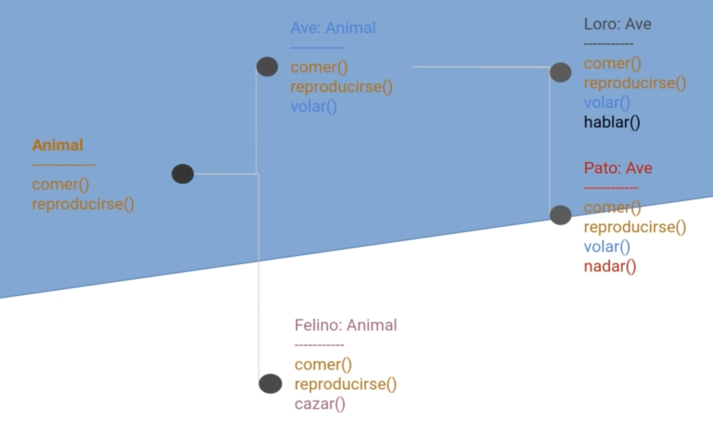

# El concepto de Herencia

Es un concepto importante de la POO que nos ayudará a no duplicar código y a reutilizar funcionalidades que ya hemos implementado. 

* La herencia es un **mecanismo para basar una clase en otra**, manteniendo su funcionalidad.
* Otra forma de definirlo es que nos permite **derivar nuevas clases de otra existente**
* A la clase base se le llama **Superclase** y a las derivadas **Subclase. `Superclase -> Subclase`
  * La `Subclase` adquiere las propiedades y las funcionalidades de la `Superclase`

## Jerarquías

Mediante la herencia vamos creando **jerarquías**.

Por ejemplo:

En Kotlin **la herencia es simple**, lo que quiere decir que una Subclase solo puede extender de una única Superclase

En cambio, la herencia es multinivel, por lo que una Subclase como Ave puede tener otras subclases como Loro o Ave. 

### Problemas de la herencia

Si abusamos de la herencia podemos tener problemas de **acoplamiento**, esto quiere decir que <u>las Subclases quedan 
atadas al destino de las Superclases para siempre</u>. Una vez se ha creado una Subclase que depende de una clase base 
será muy difícil hacer modificaciones a la clase base, ya que los efectos se propagarán descontroladamente. Así, debemos
tener muy claro al generar una clase si queremos que se pueda heredar de ella o no. 

Si no desarrollamos nuestras clases teniendo en cuenta que puedan ser extendidas, pueden dar lugar a fallos y **efectos 
secundarios**, es por ello que se recomienda extender solo de clases que hayan sido diseñadas para ello. 

