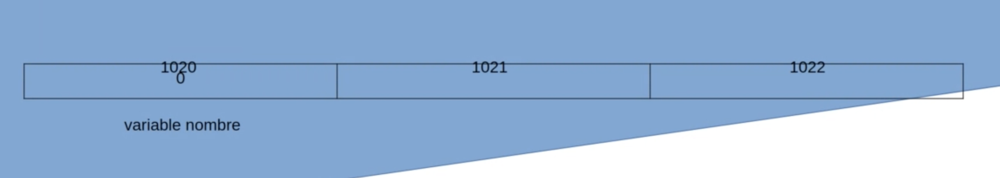

# El concepto de null

Puntero o referencia que no apunta a un objeto válido. 

## Memoria

Veamos como se organiza la memoria de nuestros programas. 

Cuando declaramos una variable de referencia lo que en realidad estamos alojando en nuestra
variable es la referencia en memoria donde está alojado nuestro objeto. 

`````kotlin
var nombre = "Ana"
`````


````kotlin
var nombre: String = null
````



En concepto de ``null`` es muy útil cuando queremos representar un objeto de clase desconocido

## Problema 

En Java cuando declaramos una variable tenemos que definir el tipo de objeto que esta contendrá. 

````java
String nombre = "Ana"; // También puede contener null
nombre = null;
nombre.length(); // ==> NullPointerException ==> Se cierra nuestra aplicación android

// Deberíamos hacer:

if(nombre != null){
    nombre.length();
}
````

## Solución Kotlin

En Kotlin y en otros lenguajes modernos se ha optado por trasladar el error para que en lugar de
que ocurra en tiempo de ejecución se produzca en tiempo de compilación

* `Tiempo de ejecución -> Tiempo de compilación`

* Tipos que aceptan el valor null: debemos declarar si una clase puede o no contener el valor
null. Y si puede, nos obliga a comprobarlo antes de operar con ella. 

````kotlin
var a: String = "abc"   // La variable a puede contener un String y no puede contener null
var b: String? = "abc"  // La variable b puede contener un String o puede contener null

b?.lenght               // Para acceder a las propiedades de b usaremos una llamada segura
b?.contains('a')        // Para llamar a las funciones miembro de b usaremos una llamada segura
````
### El operador Elvis

````kotlin
var a: String = "abc"
var b: String? = "abc"

// Asignamos a a el valor de b a no ser que esta sea null, en tal caso le asignamos un String vacío
a = b ?: "" 
````

### El operador !!


````kotlin
// Intentaremos no usarlo nunca
val longitud = b!!.length // Si b es null lanzará NullPointerException
````

````kotlin
val word: String? = "Hello World"

// Le estamos asegurando de que word nunca será null, en caso de serlo => NullPointerException
val anotherWord: String = word!! 
````


